---
## Front matter
title: "Отчёта по лабораторной работе №8"
subtitle: "Программирование
цикла. Обработка аргументов командной строки."
author: "Павлюченков Сергей Витальевич"

## Generic otions
lang: ru-RU
toc-title: "Содержание"

## Bibliography
bibliography: bib/cite.bib
csl: pandoc/csl/gost-r-7-0-5-2008-numeric.csl

## Pdf output format
toc: true # Table of contents
toc-depth: 2
lof: true # List of figures
lot: true # List of tables
fontsize: 12pt
linestretch: 1.5
papersize: a4
documentclass: scrreprt
## I18n polyglossia
polyglossia-lang:
  name: russian
  options:
	- spelling=modern
	- babelshorthands=true
polyglossia-otherlangs:
  name: english
## I18n babel
babel-lang: russian
babel-otherlangs: english
## Fonts
mainfont: PT Serif
romanfont: PT Serif
sansfont: PT Sans
monofont: PT Mono
mainfontoptions: Ligatures=TeX
romanfontoptions: Ligatures=TeX
sansfontoptions: Ligatures=TeX,Scale=MatchLowercase
monofontoptions: Scale=MatchLowercase,Scale=0.9
## Biblatex
biblatex: true
biblio-style: "gost-numeric"
biblatexoptions:
  - parentracker=true
  - backend=biber
  - hyperref=auto
  - language=auto
  - autolang=other*
  - citestyle=gost-numeric
## Pandoc-crossref LaTeX customization
figureTitle: "Рис."
tableTitle: "Таблица"
listingTitle: "Листинг"
lofTitle: "Список иллюстраций"
lotTitle: "Список таблиц"
lolTitle: "Листинги"
## Misc options
indent: true
header-includes:
  - \usepackage{indentfirst}
  - \usepackage{float} # keep figures where there are in the text
  - \floatplacement{figure}{H} # keep figures where there are in the text
---

# Цель работы

Приобретение навыков написания программ с использованием циклов и обработкой
аргументов командной строки

# Задание

1. Реализация циклов в NASM

2. Обработка аргументов командной строки

3. Задание для самостоятельной работы

# Выполнение лабораторной работы
- Реализация циклов в NASM

Создаю каталог для программ лабораторной работы № 8, перехожу в него и создаю файл lab8-1.asm (рис. @fig:001).

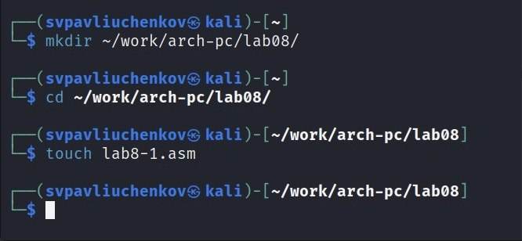{#fig:001 width=70%}

Ввожу в файл lab8-1.asm текст программы из листинга 8.1  (рис. @fig:002). 

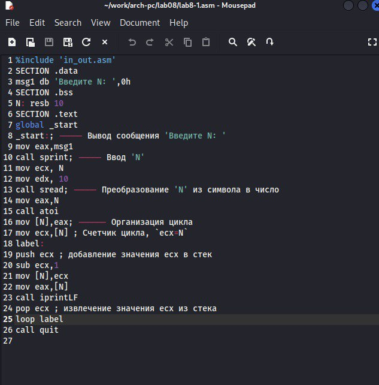{#fig:002 width=70%}

Создаю исполнительный файл и проверяю его работу (рис. @fig:003).

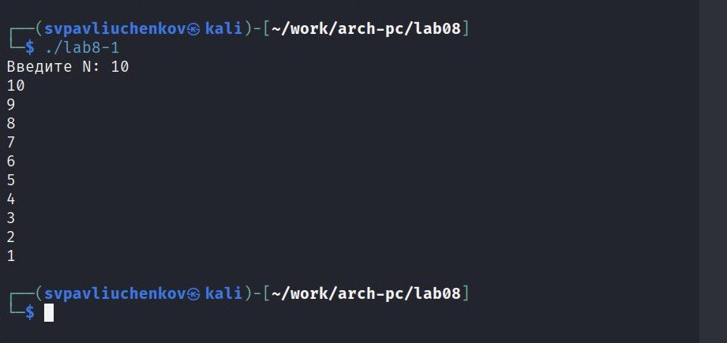{#fig:003 width=70%}

Этот алгоритм выводит все целые числа от N до 1.

Изменяю текст программы добавив изменение значение регистра ecx в цикле (рис. @fig:003).

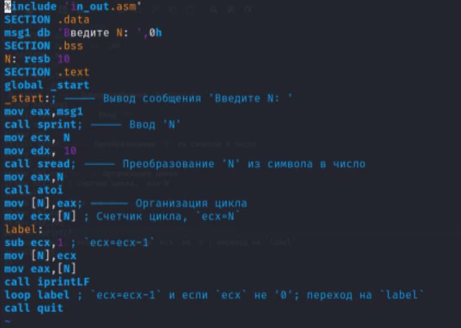{#fig:004 width=70%}

Создаю исполнительный файл и проверяю его работу (рис. @fig:005).

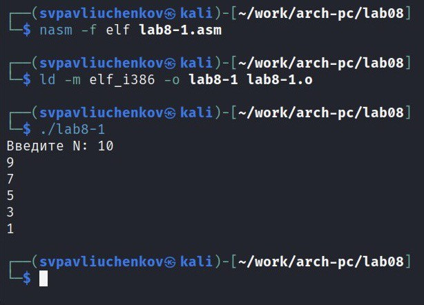{#fig:005 width=70%}

Число проходов цикла не соответствует значению 𝑁 введенному с клавиатуры.

Вношу изменения в текст программы добавив команду push и pop для сохранения 
значения счетчика цикла loop (рис. @fig:006).

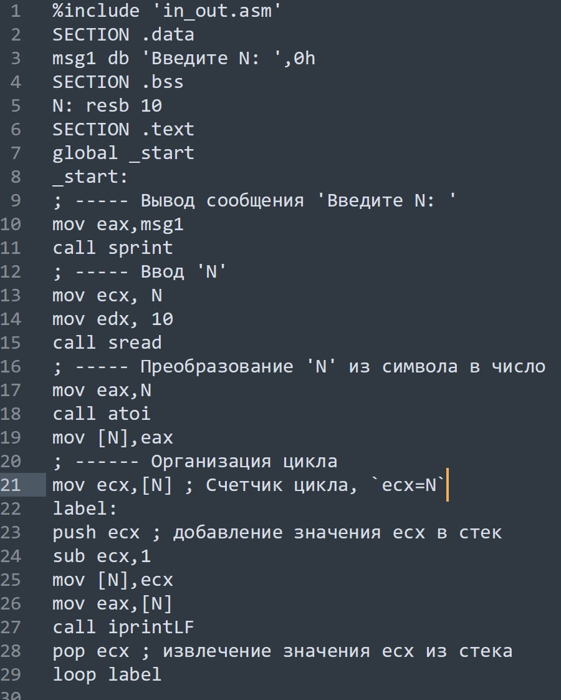{#fig:006 width=70%}

Создаю исполнительный файл и проверяю его работу (рис. @fig:005).

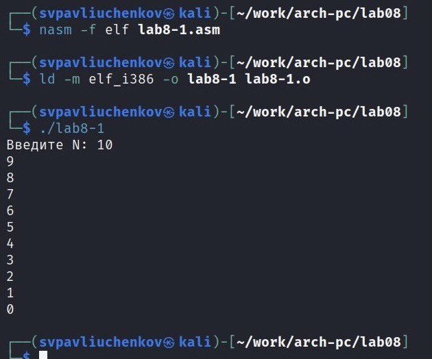{#fig:007 width=70%}

Программа выводит все целые числа от N-1 до 0 (рис. @fig:007).

Число проходов цикла соответствует значению 𝑁 введенному с клавиатуры.

- Обработка аргументов командной строки

Создаю файл lab8-2.asm в каталоге ~/work/arch-pc/lab08 и ввожу в него текст программы из листинга 8.2 (рис. @fig:008).

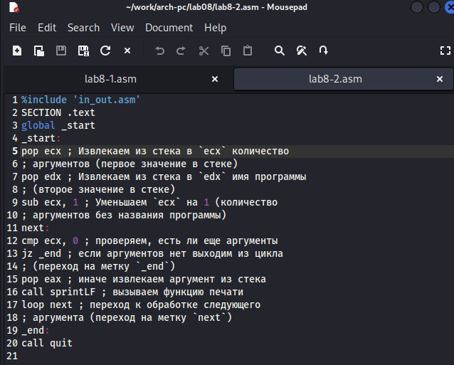{#fig:008 width=70%}

Создаю исполнительный файл и проверяю его работу (рис. @fig:009).

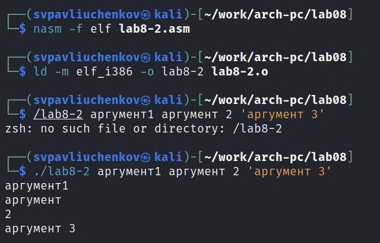{#fig:009 width=70%}

Программой было обработано 4 аргумента, так как 2 не было взято в кавычки, из-за чего засчиталось за отдельный аргумент.

Рассмотрим еще один пример программы которая выводит сумму чисел, которые передаются в программу как аргументы. 

Создаю файл lab8-3.asm в каталоге ~/work/archpc/lab08 и ввожу в него текст программы из листинга 8.3(рис. @fig:010).

{#fig:010 width=70%}

Создаю исполнительный файл и проверяю его работу (рис. @fig:011).

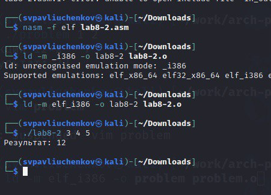{#fig:011 width=70%}

Изменяю текст программы из листинга 8.3 для вычисления произведения аргументов командной строки(рис. @fig:012)

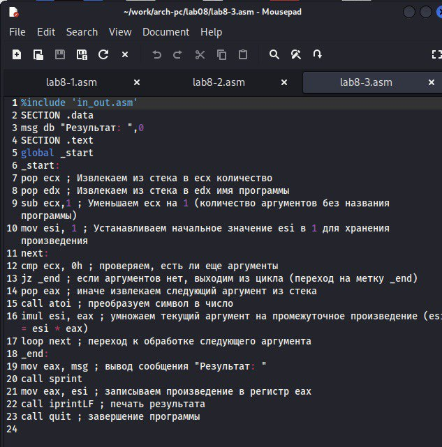{#fig:012 width=70%}

Создаю исполнительный файл и проверяю его работу (рис. @fig:003).

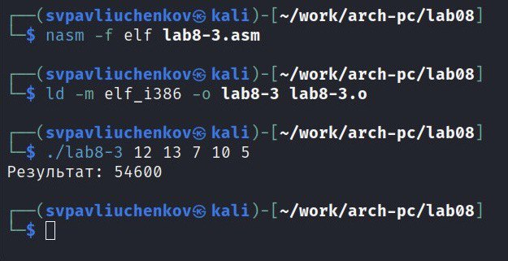{#fig:013 width=70%}

- Задание для самостоятельной работы

Пишу программу, которая находит сумму значений функции (12x - 7) для x=x1 x2, ..., xn, т.е. программа должна выводить значение f(x1) + f(x2) +... + f(xn).Значения xi передаются как аргументы. 

Создаю файл problem.asm пишу для него программу (рис. @fig:014).

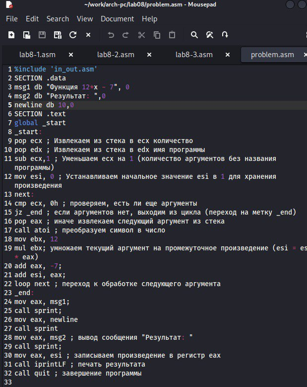{#fig:014 width=70%}

Создаю исполняемый файл и проверяю его работу на нескольких наборах x = x1,x2,...,xn.

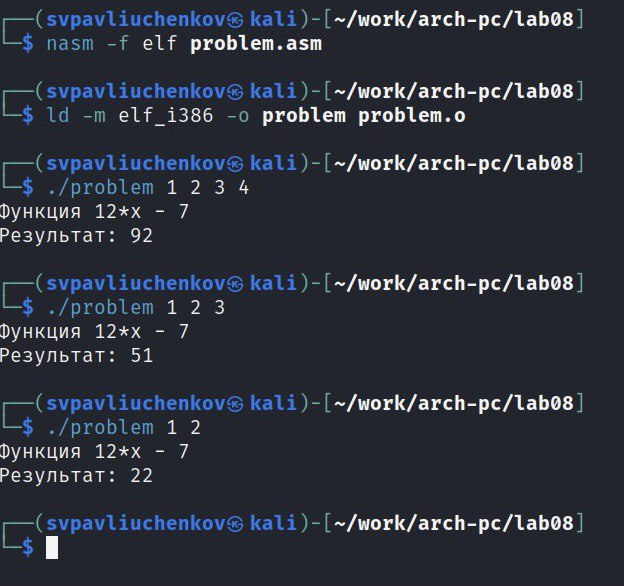{#fig:015 width=70%}

Программа выдает точные значения.

# Выводы

Я научился писать программы с использованием циклов и обработкой аргументов командной строки.

# Список литературы{.unnumbered}
Лабораторная работа №8
 
GDB: The GNU Project Debugger. — URL: https://www.gnu.org/software/gdb/

NASM Assembly Language Tutorials. — 2021. — URL: https://asmtutor.com/
 
