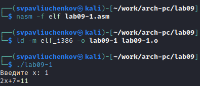

---
## Front matter
title: "Отчёта по лабораторной работе №9"
subtitle: "Понятие подпрограммы. Отладчик GDB."
author: "Павлюченков Сергей Витальевич"

## Generic otions
lang: ru-RU
toc-title: "Содержание"

## Bibliography
bibliography: bib/cite.bib
csl: pandoc/csl/gost-r-7-0-5-2008-numeric.csl

## Pdf output format
toc: true # Table of contents
toc-depth: 2
lof: true # List of figures
lot: true # List of tables
fontsize: 12pt
linestretch: 1.5
papersize: a4
documentclass: scrreprt
## I18n polyglossia
polyglossia-lang:
  name: russian
  options:
	- spelling=modern
	- babelshorthands=true
polyglossia-otherlangs:
  name: english
## I18n babel
babel-lang: russian
babel-otherlangs: english
## Fonts
mainfont: PT Serif
romanfont: PT Serif
sansfont: PT Sans
monofont: PT Mono
mainfontoptions: Ligatures=TeX
romanfontoptions: Ligatures=TeX
sansfontoptions: Ligatures=TeX,Scale=MatchLowercase
monofontoptions: Scale=MatchLowercase,Scale=0.9
## Biblatex
biblatex: true
biblio-style: "gost-numeric"
biblatexoptions:
  - parentracker=true
  - backend=biber
  - hyperref=auto
  - language=auto
  - autolang=other*
  - citestyle=gost-numeric
## Pandoc-crossref LaTeX customization
figureTitle: "Рис."
tableTitle: "Таблица"
listingTitle: "Листинг"
lofTitle: "Список иллюстраций"
lotTitle: "Список таблиц"
lolTitle: "Листинги"
## Misc options
indent: true
header-includes:
  - \usepackage{indentfirst}
  - \usepackage{float} # keep figures where there are in the text
  - \floatplacement{figure}{H} # keep figures where there are in the text
---

# Цель работы

Приобретение навыков написания программ с использованием подпрограмм. Знакомство
с методами отладки при помощи GDB и его основными возможностями.

# Задание

1. Реализация подпрограмм в NASM
2. Отладка программам с помощью GDB
3. Задание для самостоятельной работы

# Выполнение лабораторной работы
- Реализация циклов в NASM
Создаю каталог для программ лабораторной работы № 9, перехожу в него и создаю файл lab9-1.asm (рис. @fig:001).

{#fig:001 width=70%}

Ввожу в файл lab9-1.asm текст программы из листинга 9.1  (рис. @fig:002).
 
{#fig:002 width=70%}

Создаю исполнительный файл и проверяю его работу (рис. @fig:003).

{#fig:003 width=70%}

Эта программа считает и выводит выражение $2*x + 7$, в котором x вводится пользователем.

Изменяю текст программы добавляя подпрограмму subcalcul(рис. @fig:004).

{#fig:004 width=70%}

Создаю исполнительный файл и проверяю его работу (рис. @fig:005).

{#fig:005 width=70%}

Программа работает корректно(g(x)=$3*1 - 1 = 2$, f(g(x)) = $2 * 2 + 7 = 11$)

- Отладка программам с помощью GDB

Cоздаю файл lab9-2.asm (рис. @fig:006)

{#fig:006 width=70%}

Ввожу в файл lab9-2.asm текст программы из листинга 9.2  (рис. @fig:007). 

{#fig:007 width=70%}

Создаю исполнительный файл и загружаю его в отладчик GDB (рис. @fig:008).

{#fig:008 width=70%}

Проверяю работу программы, запуская её в оболочке GDB (рис. @fig:009).

{#fig:009 width=70%}

Устанавливаю брейкпоинт и опять запускаю программу (рис. @fig:010).

{#fig:010 width=70%}

Смотрю дисассимилированный код программы с помощью команды disassemble начиная с метки start (рис. @fig:011).

{#fig:011 width=70%}

Переключаюсь на отображение команд с Intel’овским синтаксисом, введя команду set disassembly-flavor intel

{#fig:012 width=70%}

В режиме ATT для обозначения регистров используется префикс %, а в режиме Intel префиксы для регистров не используются, они просто обозначаются именами регистров. 
В режиме ATT для обозначения констант используется префикс $, а в режиме Intel префикс $ для обозначения констант не требуется, константы просто записываются как числа или адреса. 
При выводе дисассимилированного кода в режиме ATT сначала идет константа, и потом регистр, а при выводе в режиме Intel сначала регистр, и потом константа.

Проверяю какая точка остановки у меня установлена (рис. @fig:013).

{#fig:013 width=70%}

Определяю адрес предпоследней строки программы из рисунка 12 и устанавливаю новую точку останова (рис. @fig:014).

{#fig:014 width=70%}

Выполняю 5 инструкций с помощью команды stepi и прослеживаю за изменением значений регистров.

{#fig:015 width=70%}

Изменились значения регистров eax, ecx, edx, ebx, eip.

Смотрю значение переменной msg1 по имени (рис. @fig:016).

{#fig:016 width=70%}

Смотрю значение переменной msg2 по адресу (рис. @fig:017).

{#fig:017 width=70%}

Изменяю значение регистра msg1 с помощью команды set, задав ей в качестве аргумента имя регистра (рис. @fig:018).

{#fig:018 width=70%}

'H' поменялся на 'h'.

Изменяю значение регистра msg2 с помощью команды set, задав ей в качестве аргумента имя регистра (рис. @fig:019).

{#fig:019 width=70%}

Вывожу значение регистра edx в разных форматах (рис. @fig:020).

{#fig:020 width=70%}

Изменяю значение регистра ebx с помощью команды set (рис. @fig:021).

{#fig:021 width=70%}

Когда значение 2 (как целое число, без кавычек), gdb интерпретирует его как целое число и выводит его значение как 2, а когда с кавычками, то выводится номер соответствующий элементу в ASCII.

Завершаю выполнение программы с помощью команды continue (сокращенно c) и выхожу из GDB с помощью команды quit (сокращенно q) (рис. @fig:022).

{#fig:022 width=70%}

- Обработка аргументов командной строки в GDB
Скопировал файл lab8-2.asm, созданный при выполнении лабораторной работы №8,
с программой выводящей на экран аргументы командной строки в файл с именем lab09-3.asm, создал исполняемый файл и загрузил исполняемый файл в отладчик, указав аргументы (рис. @fig:023).

{#fig:023 width=70%}

Устанавливаю брейкпоинт и запускаю отладчик (рис. @fig:024).

{#fig:024 width=70%}

Смотрю остальные позиции стека – по адресу [esp+4] располагается адрес в памяти где находиться имя программы, по адесу [esp+8] храниться адрес первого аргумента, по адресу [esp+12] – второго и т.д(рис. @fig:025).

{#fig:025 width=70%}

Шаг изменения адреса равен 4 потому, что в архитектуре x86 данные обычно выравниваются по границе 4 байта.

- Задание для самостоятельной работы
Преобразовываю программу из лабораторной работы №8 (Задание №1 для самостоятельной работы), реализовав вычисление значения функции f(x) как подпрограмму(рис. @fig:026).

{#fig:026 width=70%}

Запуск программы и проверки, что она работает правильно(рис. @fig:027).

{#fig:027 width=70%}

Все работает правильно.

Ввожу в файл problem-2.asm текст программы из листинга 9.3  (рис. @fig:028). 

{#fig:028 width=70%}

Запуск программы и проверка, что она работает некорректно (рис. @fig:029).

{#fig:029 width=70%}

Отладка показа, что сначала в ebx записывается 3, потом в eax 2, после в ebx записывается 5 (сумма прошлых двух). после ecx становится 4 и eax становится 8 (2 * 4), и наконец ebx = 10(рис. @fig:030). Ошибка заключается в том, что умножение происходит на eax, а не на ebx. 

{#fig:030 width=70%}

Меняю умножение на ebx в программе. (рис. @fig:031)

{#fig:031 width=70%}

Запускаю программу, чтобы проверить, что все верно. (рис. @fig:032)

{#fig:032 width=70%}

В этот раз программа выводит верный ответ - 25.

# Выводы

Выполнив эту работу я научился писать и использовать подпрограммы и ознакомился с отладчиком GDB, и его инструментами и функциями.

# Список литературы{.unnumbered}
::: Лабораторная работа №9
::: GDB: The GNU Project Debugger. — URL: https://www.gnu.org/software/gdb/
::: NASM Assembly Language Tutorials. — 2021. — URL: https://asmtutor.com/
::: 
