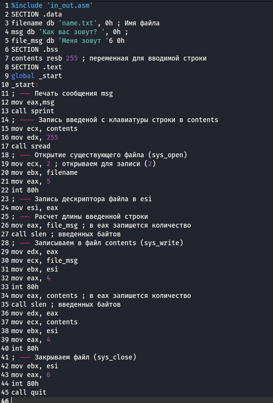
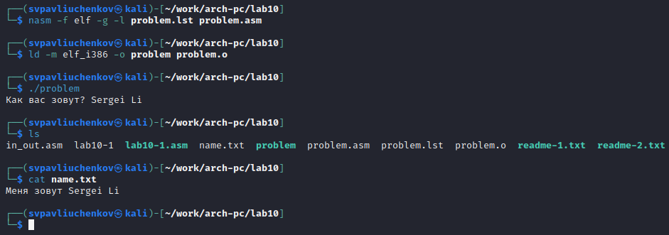

---
## Front matter
title: "Отчёта по лабораторной работе №10"
subtitle: "Работа с файлами средствами Nasm"
author: "Павлюченков Сергей Витальевич"

## Generic otions
lang: ru-RU
toc-title: "Содержание"

## Bibliography
bibliography: bib/cite.bib
csl: pandoc/csl/gost-r-7-0-5-2008-numeric.csl

## Pdf output format
toc: true # Table of contents
toc-depth: 2
lof: true # List of figures
lot: true # List of tables
fontsize: 12pt
linestretch: 1.5
papersize: a4
documentclass: scrreprt
## I18n polyglossia
polyglossia-lang:
  name: russian
  options:
	- spelling=modern
	- babelshorthands=true
polyglossia-otherlangs:
  name: english
## I18n babel
babel-lang: russian
babel-otherlangs: english
## Fonts
mainfont: PT Serif
romanfont: PT Serif
sansfont: PT Sans
monofont: PT Mono
mainfontoptions: Ligatures=TeX
romanfontoptions: Ligatures=TeX
sansfontoptions: Ligatures=TeX,Scale=MatchLowercase
monofontoptions: Scale=MatchLowercase,Scale=0.9
## Biblatex
biblatex: true
biblio-style: "gost-numeric"
biblatexoptions:
  - parentracker=true
  - backend=biber
  - hyperref=auto
  - language=auto
  - autolang=other*
  - citestyle=gost-numeric
## Pandoc-crossref LaTeX customization
figureTitle: "Рис."
tableTitle: "Таблица"
listingTitle: "Листинг"
lofTitle: "Список иллюстраций"
lotTitle: "Список таблиц"
lolTitle: "Листинги"
## Misc options
indent: true
header-includes:
  - \usepackage{indentfirst}
  - \usepackage{float} # keep figures where there are in the text
  - \floatplacement{figure}{H} # keep figures where there are in the text
---

# Цель работы

Приобретение навыков написания программ для работы с файлами

# Задание

1. Реализация программ для работы с файлами в NASM
2. Задание для самостоятельной работы

# Выполнение лабораторной работы
- Реализация циклов в NASM

Создаю каталог для программ лабораторной работы № 10, перехожу в него и создаю файл lab10-1.asm и файлы с которыми в будущем буду работать (рис. @fig:001).

{#fig:001 width=70%}

Ввожу в файл lab10-1.asm текст программы из листинга 10.1  (рис. @fig:002). 

{#fig:002 width=70%}

Создаю исполнительный файл и проверяю его работу (рис. @fig:003).

{#fig:003 width=70%}

Эта программа записывает строку в файл, которую вводит пользователь.

С помощью команды chmod изменяю права доступа к исполняемому файлу lab10-1, запрещая его выполнение.(рис. @fig:004).

{#fig:004 width=70%}

Из-за того, что у меня отсутствует право доступа к этому файлу, я не могу его запустить. 

С помощью команды chmod изменяю права доступа к файлу lab10-1.asm с исходным
текстом программы, добавив права на исполнение. (рис. @fig:005).

{#fig:005 width=70%}

Из-за того, что файл lab10-1 не содержит машинный код исполнение этого файла возвращает только ошибки.

В соответствии с 13 вариантом предоставляю права доступа к файлу readme1.txt представленные в символьном виде, а для файла readme-2.txt – в двочном виде.

{#fig:006 width=70%}

- Задание для самостоятельной работы

Напишите программу работающую по следующему алгоритму:

Вывод приглашения “Как Вас зовут?”

ввести с клавиатуры свои фамилию и имя

создать файл с именем name.txt

записать в файл сообщение “Меня зовут”

дописать в файл строку введенную с клавиатуры

закрыть файл

Для этого я преобразую программу из листинга 10.1.

{#fig:007 width=70%}

Запускаю программы и проверки, что она работает правильно используя ls и cat(рис. @fig:008).

{#fig:008 width=70%}

Все работает правильно.

# Выводы

Выполнив эту работу я научился писать программы для работы с файлами в NASM.

# Список литературы{.unnumbered}
::: Лабораторная работа №10
::: GDB: The GNU Project Debugger. — URL: https://www.gnu.org/software/gdb/
::: NASM Assembly Language Tutorials. — 2021. — URL: https://asmtutor.com/
::: 
